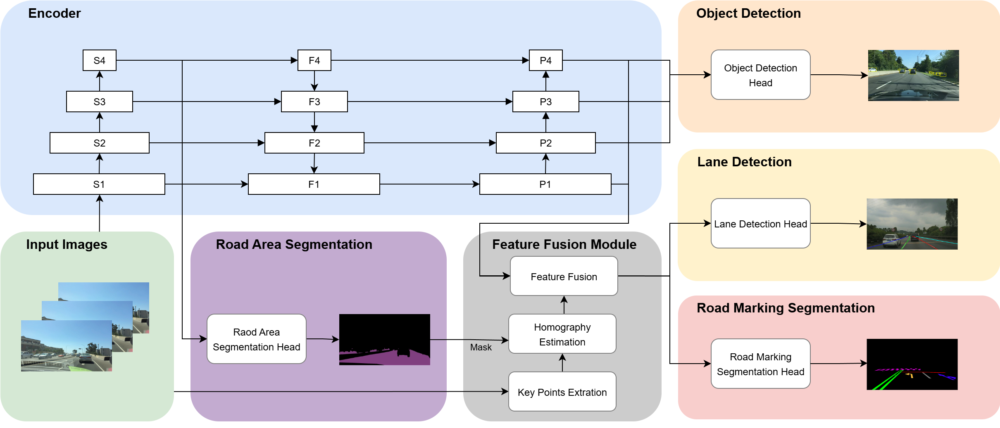

<div align="center">
<h1> Multi-Task Visual Perception Incorporated with Temporal Feature </h1>
</div>



## Introduction

With the rapid development of autonomous driving technology, accurate scene perception has become essential for safe and efficient navigation. Key perception tasks such as lane detection, semantic segmentation of road markings and road area, and object detection directly impact vehicle decision-making and obstacle avoidance. However, most existing methods are trained on single-task datasets, limiting data diversity and reducing performance in complex scenarios such as occlusion or lighting variation.This paper proposes a multi-task perception system based on consecutive video frames, integrating lane detection, road marking and road area segmentation, and object detection into a unified framework. The system employs multi-task learning to share features and improve computational efficiency, and adopts cross-dataset training to enhance generalization across tasks. Additionally, temporal information from adjacent frames is leveraged to compensate for visual degradation in the current frame.Experimental results on multiple public datasets demonstrate that the proposed method achieves competitive or superior performance in all three tasks. Visualization further shows improved segmentation results under challenging conditions, validating the system’s effectiveness in task integration.

## Set Envirionment

This codebase has been developed with python version 3.11, PyTorch 2.1.2+ and torchvision 0.16+
```setup
pip install torch==2.1.2 torchvision==0.16 -c pytorch
```

See requirements.txt for additional dependencies and version requirements.

```setup
pip install -r requirements.txt
```
## Dataset
Download the datasets form following links:

BDD100K: [images](https://bdd-data.berkeley.edu/), [det_annot](https://drive.google.com/file/d/1d5osZ83rLwda7mfT3zdgljDiQO3f9B5M/view), [da_seg_annot](https://drive.google.com/file/d/1yNYLtZ5GVscx7RzpOd8hS7Mh7Rs6l3Z3/view), [ll_seg_annot](https://drive.google.com/file/d/1BPsyAjikEM9fqsVNMIygvdVVPrmK1ot-/view)

SeRM: [images & annotations](https://drive.google.com/drive/folders/14w4zUYYD1pTwVQbDdDBBct6UKWybnn9s?usp=sharing)

VIL-100: [images & annotations](https://drive.google.com/drive/folders/178_SSeQ4M1hI3BrTonhiTrpOWTEAenLE)

The dataset directory structure will be the following:

```
├─ dataset root
└── ├─ BDD100K
    |  ├─ images
    |  │  ├─ train
    |  │  └─ val
    |  ├─ det_annotations
    |  │  ├─ train
    |  │  └─ val
    |  ├─ da_seg_annotations
    |  │  ├─ train
    |  │  └─ val
    |  └─ ll_seg_annotations
    |     ├─ train
    |     └─ val
    ├─ SeRM
    |  ├─ train
    |  |  ├─ image
    |  |  ├─ label
    |  └─ val
    |     ├─ image
    |     ├─ label
    └─ VIL-100
       ├─ Annotation
       ├─ data
       ├─ JPEGImages
       └─ Json
```

## Training

```shell
python tools/train.py
```

You can modify the parameters from `./lib/config/default.py`

## Evaluation

```shell
python tools/test.py --weights weights/epoch-195.pth
```

## Demo

You can store the image or video in `--source`, and then save the reasoning result to `--save-dir`

```shell
python tools/demo.py --weights weights/epoch-195.pth
                     --source inference/image
                     --save-dir inference/image_output
```

